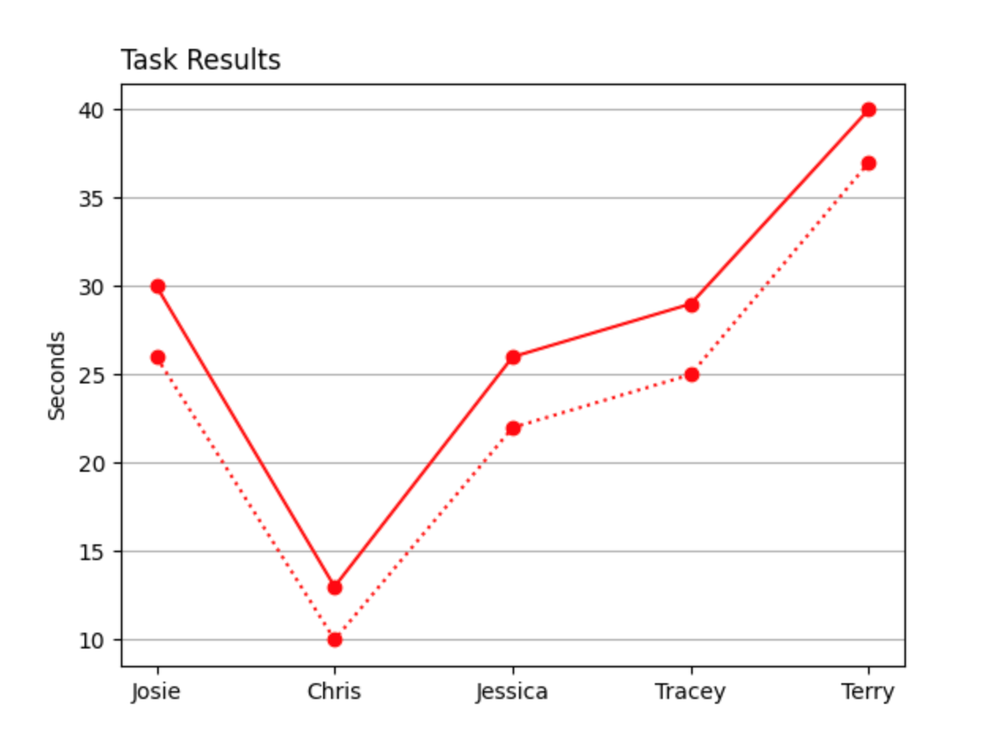

# Python Plot

The x-axis contains the participants doing the task and the y-axis is the seconds it took them to complete the task. The red solid line is the seconds it took for each participant to report an animal sighting in the TreadLightly app. The red dotted line is the amount of time each participant took looking at the notification page.
